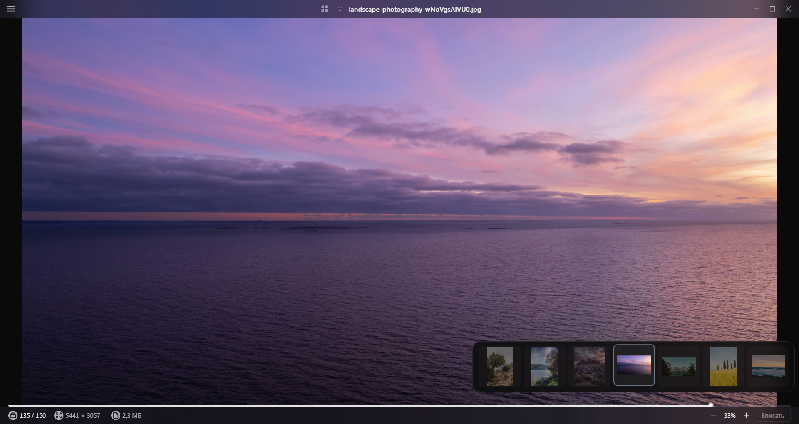

<b>English</b> · <a href="README.ru.md">Русский</a>

  

<h1 align="center">Aperture</h1>

  A fast photo viewer for Windows and macOS. 
  Double-click a file and it's on screen. Arrow keys walk the folder, number keys rate, nothing sits on top of the frame.

  
  
  
  

  

---

## Why another viewer

- **It opens instantly.** A photo double-clicked in Explorer shows up in its own quick-look window; `Esc` closes it. The window with your folders and tabs is left alone.
- **It stays out of the way.** In photo mode there is nothing of the app above the frame — just two translucent bars that fade when the cursor stops moving.
- **It culls, it doesn't catalogue.** Ratings `1–5`, pick and reject flags, a histogram — what you need to go through a folder after a shoot. Ratings are written as XMP, so Lightroom and Bridge see them. There is no database, no import, no library: the folder on disk is the library.

## Features

### Viewing
- The frame fills the window; zoom with the wheel or keys, `Z` toggles fit ↔ 1:1, `WASD` pans a zoomed photo.
- A scrubber along the bottom with a thumbnail popup — skim a folder of a thousand photos in a second.
- Full screen `F`, slideshow `Space` with a 3/5/10 s interval.
- `I` panel — camera, lens, shutter, aperture, ISO, focal length, date, resolution, file size. `H` — histogram.
- Lossless 90° rotation for JPEG (`R` / `Shift+R`) — only the EXIF orientation changes.

### Folders
- A thumbnail grid with subfolders: step inside, go up with `Backspace`, go back and forward like in a browser (`Alt+←` / `Alt+→`).
- Tabs — one folder per tab. The session is restored on the next launch.
- Folder panel `Ctrl+B`: drives, Places (Pictures, Desktop, Downloads), pinned and recent folders.
- Sort by name, capture date, modified date, size, type or rating; recursive scan of subfolders.
- Folder watching: files added or changed on disk show up on their own.

### Culling
- Rating `1–5` (`0` clears). JPEG, PNG, WebP, TIFF and HEIC get XMP inside the file; RAW, BMP and SVG get a `.xmp` sidecar next to it. The file's modified date is preserved.
- `P` — pick, `X` — reject. Filters "picks only" and "hide rejected".
- Auto-advance: a rating or flag from the keyboard moves to the next photo right away — Lightroom's Auto Advance, minus the Caps Lock.
- Sort by rating without reloading the folder.

### Files
- Move to trash (`Delete`), rename (`F2`), copy (`Ctrl+Shift+C`), reveal in Explorer/Finder (`Ctrl+Shift+R`).
- File associations and "Open with" are set up by the installer. Recent files in the Windows jump list and the macOS Dock menu.
- Right-click context menu with the same actions as the "Photo" menu.

### Shell
- A calm dark theme, system font, Heroicons. Accent colour is in Settings.
- The window remembers its size, position and maximized state.
- Keyboard help on `?`: a keyboard drawing with bound keys highlighted, plus a list by group.

## Formats

| Group | Extensions | How it's shown |
| --- | --- | --- |
| Common | JPEG · PNG · WebP · AVIF · GIF · BMP · SVG | the original, as in a browser |
| Need a decoder | HEIC / HEIF · TIFF | converted in the background, the original is cached |
| RAW | CR2 · CR3 · NEF · ARW · DNG · ORF · RW2 · RAF | the full-size JPEG preview embedded in the file |

RAW is displayed from the preview the camera wrote — no demosaicing. That's fast and enough for culling, but colour and sharpness are the camera JPEG's, not a developed file's. PSD is not supported.

## Download

Builds are in [Releases](https://github.com/OWNER/REPO/releases). Current version — **0.10.0, beta**.

| File | What it is |
| --- | --- |
| `Aperture-0.10.0-x64.exe` | Windows installer: file associations, "Open with", a shortcut. You can pick the install folder. |
| `Aperture-0.10.0-x64.zip` | No install: unpack and run `Aperture.exe`. Doesn't register associations; settings and cache still live in `%APPDATA%\Aperture`. |
| `Aperture-0.10.0-arm64.dmg` | macOS on Apple Silicon. There is no Intel build. |

### The build is unsigned

The project has no code-signing certificates yet, so both systems warn about an unknown publisher. That's expected for a beta:

- **Windows.** SmartScreen: **More info → Run anyway**. If in doubt, every release lists the SHA-256 of both files and a VirusTotal report.
- **macOS.** On first launch: System Settings → Privacy & Security → **Open Anyway** at the bottom. Or in Terminal: `xattr -cr /Applications/Aperture.app`.

Signing and auto-update are the next stage after the beta.

## Keys

The full list is on `?` inside the app. The most used:

| | Windows | macOS |
| --- | --- | --- |
| Previous / next | `←` `→` | `←` `→` |
| Open from grid · close | `Enter` · `Esc` | `Enter` · `Esc` |
| Fit · 1:1 | `Ctrl+0` · `Z` | `⌘0` · `Z` |
| Full screen · slideshow | `F` · `Space` | `F` · `Space` |
| Info · histogram | `I` · `H` | `I` · `H` |
| Rate · clear | `1`–`5` · `0` | `1`–`5` · `0` |
| Pick · reject | `P` · `X` | `P` · `X` |
| Trash · rename | `Delete` · `F2` | `⌫` · `F2` |
| Folder up · back / forward | `Backspace` · `Alt+←` `Alt+→` | `⌫` · `⌘[` `⌘]` |
| Folder panel · settings | `Ctrl+B` · `Ctrl+,` | `⌘B` · `⌘,` |
| Tabs | `Ctrl+T` `Ctrl+W` `Ctrl+Tab` | `⌘T` `⌘W` `⌃Tab` |

## Privacy and data

- The app **never goes online**: no telemetry, no update checks, nothing is sent anywhere.
- Your photos are not copied or fully indexed. The thumbnail and converted-original cache lives in `%APPDATA%\Aperture` (Windows) or `~/Library/Application Support/Aperture` (macOS); the limit is in Settings and the folder can be deleted at any time.
- The only thing the app ever writes into your files is the XMP rating, and only when you set one. For RAW, BMP and SVG it creates a `.xmp` sidecar next to the file; the file itself is untouched.

## Known limitations of the beta

- Builds are unsigned (see above).
- The macOS build compiles, but has had far less testing than Windows.
- RAW is preview-only; on some cameras the embedded preview is smaller than full resolution.
- No Linux, no Intel macOS build, no auto-update.
- No editing, tags, content search or cloud sync — none planned. It's a viewer.

## Feedback

Found a bug or missing something — [open an issue](https://github.com/OWNER/REPO/issues/new). Helpful to include: Windows/macOS version, installer or zip, the file format, what you did and what you expected. A screenshot always helps.

## What's in this repository

Builds, release notes and images only. The application's source code is not published. Issues are open — that's the main place for reports and suggestions.

## License

The beta is free and provided as is, for testing. Terms for the stable version will be announced with the first release.
